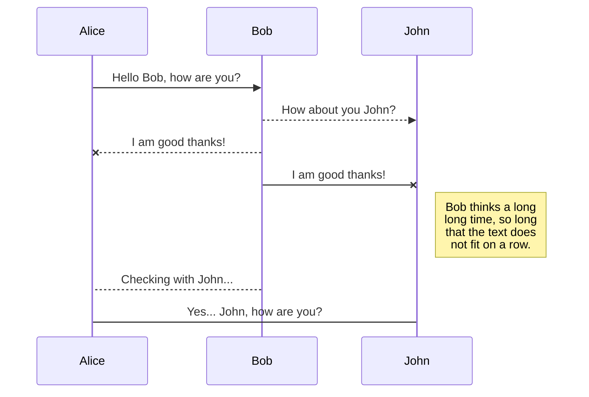

# Rapid Prototyping Template

本レポジトリは Web アプリケーションのラピッドプロトタイピングのためのテンプレート（Rapid Prototyping Template in English）です。

本テンプレートは素早く概念検証の開発に着手し、PoC（Proof of Concept）の開発のイテレーションを高速に回すための最小構成です。

是非あなたの考える Web サービスの UX ブループリントの確認や PoC に利用してください。

興味がある方は本 README.md の下部にある「私に協力してくれる方」も目を通してください。

## 本テンプレートの利用を推奨する対象

- Web サービスを活用したビジネスを急速に立ち上げたい方
- Web サービスのプロトタイプや UX ブループリントが今すぐ必要な方
- また、上記の開発を任せられている担当者

## IT の新規ビジネスに存在する課題

IT の可能性は議論するまでもなく、日本は国を挙げての DX・IT 活用が推進されており、その需要は日々増加している

IT を活用したビジネスでは、まずはハリボテの試作品を用意し、ソリューションの検証するまでのスピードが重要となる

しかし、プロトタイプの作成には一定の技術的な難しさと時間的な煩わしさがある。

アイデアを思いついたときにすぐに実証が始められるようなテンプレートがあれば有用と感じ、本プロジェクトを開始した。

## Rapid Prototyping Template の利用に必要なもの

あなたの作成する予定の PoC で利用する AWS アカウントを用意します。

あとはその PoC がユーザのニーズを満たすこと、すなわち PSF（Problem Solution Fit）へと導く"やる気"こそが重要となります。

Make コマンドが実行できるようにしてください。

## [WIP] 使用技術

- GitHub Actions: ~
- AWS（Amazon Web Service）: ~
- Terraform: ~
- Next.js: 昨今のフロントエンドのトレンドと汎用性の高さから Next.js を利用しているが、各自で置き換えてもらえると別のフロントエンドフレームワークでも代用可能です。

## Rapid Prototyping Template のアーキテクチャ



## 利用方法

コードをクローンしましょう。

```
$ gh repo clone okmtdev/rapid_prototyping_template
```

そのあと、make コマンドを使って初期化してください。

```
make init
```

これで prototype ディレクトリと Next.js の初期ファイルが生成されたと思います。

`prototype/next.config.js`で nextConfig が`{}`となっていると思うので、それを以下のように修正します。

```
const nextConfig = {
  output: 'export',
}
```

インフラを構築しましょう。

```
terraform init
terraform plan
terraform apply
```

開発を始めましょう！あとは好きなコードを書いて push するだけです。

```
git add prototype
git commit & git push
```

## [WIP] 説明

```
tree
```

### infrastructure ディレクトリ

~

### .github ディレクトリ

~

## make init で失敗する場合

create-next-app の実行が失敗したようです。

npm コマンドは以下のバージョンで動作することを確認しています。

```
$ npm -v
10.2.3
```

もしバージョンが異なる場合は npm のバージョンを合わせて実行してみてください。

## make ssg/ssg-linux で失敗する場合

やりたいのは、`npm run build`を下記のように修正することだけなので、手動で作業してください。

```
    "build": "next build && next export",
```

## 私に協力してくれる方

私たちは常に新しいことに挑戦し続ける仲間を探しています。

もし私たちに興味が沸いた方、お話だけでも聞きたいという方は okmtdev@gmail.com まで連絡いただけるとさいわいです。
