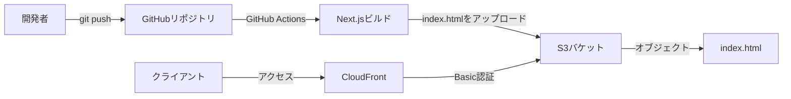
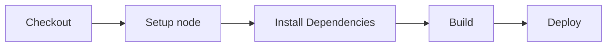

# Rapid Prototyping Template

本レポジトリは Web アプリケーションのラピッドプロトタイピングのためのテンプレート（Rapid Prototyping Template in English）です。

<!-- START doctoc generated TOC please keep comment here to allow auto update -->
<!-- DON'T EDIT THIS SECTION, INSTEAD RE-RUN doctoc TO UPDATE -->

- [概要](#%E6%A6%82%E8%A6%81)
  - [Rapid Prototyping Template の想定利用者](#rapid-prototyping-template-%E3%81%AE%E6%83%B3%E5%AE%9A%E5%88%A9%E7%94%A8%E8%80%85)
  - [IT の新規ビジネスに存在する課題](#it-%E3%81%AE%E6%96%B0%E8%A6%8F%E3%83%93%E3%82%B8%E3%83%8D%E3%82%B9%E3%81%AB%E5%AD%98%E5%9C%A8%E3%81%99%E3%82%8B%E8%AA%B2%E9%A1%8C)
  - [使用技術](#%E4%BD%BF%E7%94%A8%E6%8A%80%E8%A1%93)
  - [Rapid Prototyping Template のアーキテクチャ](#rapid-prototyping-template-%E3%81%AE%E3%82%A2%E3%83%BC%E3%82%AD%E3%83%86%E3%82%AF%E3%83%81%E3%83%A3)
- [Rapid Prototyping Template の利用方法](#rapid-prototyping-template-%E3%81%AE%E5%88%A9%E7%94%A8%E6%96%B9%E6%B3%95)
  - [アカウント準備](#%E3%82%A2%E3%82%AB%E3%82%A6%E3%83%B3%E3%83%88%E6%BA%96%E5%82%99)
  - [インフラ準備](#%E3%82%A4%E3%83%B3%E3%83%95%E3%83%A9%E6%BA%96%E5%82%99)
  - [GitHub Actions の準備](#github-actions-%E3%81%AE%E6%BA%96%E5%82%99)
  - [アプリケーション開発](#%E3%82%A2%E3%83%97%E3%83%AA%E3%82%B1%E3%83%BC%E3%82%B7%E3%83%A7%E3%83%B3%E9%96%8B%E7%99%BA)
  - [infrastructure ディレクトリの説明](#infrastructure-%E3%83%87%E3%82%A3%E3%83%AC%E3%82%AF%E3%83%88%E3%83%AA%E3%81%AE%E8%AA%AC%E6%98%8E)
  - [.github ディレクトリの説明](#github-%E3%83%87%E3%82%A3%E3%83%AC%E3%82%AF%E3%83%88%E3%83%AA%E3%81%AE%E8%AA%AC%E6%98%8E)
  - [make init で失敗する場合](#make-init-%E3%81%A7%E5%A4%B1%E6%95%97%E3%81%99%E3%82%8B%E5%A0%B4%E5%90%88)
- [今後の展望](#%E4%BB%8A%E5%BE%8C%E3%81%AE%E5%B1%95%E6%9C%9B)
  - [私に協力してくれる方](#%E7%A7%81%E3%81%AB%E5%8D%94%E5%8A%9B%E3%81%97%E3%81%A6%E3%81%8F%E3%82%8C%E3%82%8B%E6%96%B9)

<!-- END doctoc generated TOC please keep comment here to allow auto update -->

## 概要

本テンプレートは素早く概念検証の開発に着手し、PoC（Proof of Concept）の開発のイテレーションを高速に回すための最小構成です。

是非あなたの考えたビジネスアイディアの UX ブループリントの確認や PoC に利用してください。

### Rapid Prototyping Template の想定利用者

- Web サービスを活用したビジネスアイディアの PoC を試したい方
- Web サービスのプロトタイプや UX ブループリントが今すぐ必要な方
- また、上記の開発を任せられている担当者

### IT の新規ビジネスに存在する課題

IT の可能性は議論するまでもなく、日本は国を挙げての DX・IT 活用が推進されており、その需要は日々増加しています。

IT を活用したビジネスでは、まずはハリボテの試作品を用意し、アイディアやソリューションの検証するまでのスピードが重要です。

しかし、プロトタイプの作成には一定の技術的な難しさと時間的な煩わしさがあります。

そこで、アイデアを思いついたときにすぐに実証が始められるようなテンプレートがあれば有用と感じ、本プロジェクトを開始しました。

このような OSS 活動や私の活動に興味がある方は本 README.md の下部にある「私に協力してくれる方」も目を通してください。

### 使用技術

- [Next.js](https://nextjs.org/): 昨今のフロントエンドのトレンドと汎用性の高さから Next.js を利用しています。別のフロントエンドフレームワークでも代用可能です。
- [AWS（Amazon Web Service）](https://aws.amazon.com/jp/): Amazon の提供する信頼性と拡張性に優れたクラウドコンピューティングサービスです。開発されるアプリケーションは全て AWS のリソースで動かします。
- [GitHub Actions](https://github.co.jp/features/actions): GitHub の提供するワークフロー自動化ツール。Next.js のビルドとビルド成果物を S3 にアップロードするのに利用します。
- [Terraform](https://www.terraform.io/): IaC（Infrastructure as Code） と呼ばれるツールの一種で、インフラの構成をソースコードとして管理できる機能

### Rapid Prototyping Template のアーキテクチャ



- 開発者はローカルで Next.js アプリケーションを開発して、push します。
- クライアントは手元の PC やスマホから CloudFront の URL へとアクセスします。
- CloudFront の URL は [Basic 認証](https://ja.wikipedia.org/wiki/Basic%E8%AA%8D%E8%A8%BC)を求められます。
- Basic 認証は CloudFront Function で実装しています。
- GitHub Actions は Next.js のビルドと S3 へのアップロードをします。

## Rapid Prototyping Template の利用方法

### アカウント準備

まずは作成するプロトタイプがユーザのニーズを満たすこと、すなわち PSF（Problem Solution Fit）へと導く"やる気"こそが重要となります。

あなたの利用する AWS アカウントを用意し、AWS CLI を使えるようにしてください。

[【AWS】aws cli の設定方法 | Zenn](https://zenn.dev/akkie1030/articles/aws-cli-setup-tutorial)

Terraform コマンドがそのアカウントに向けて実行できるようにしてください。

また、Node の実行環境（npm が利用できれば OK）と Make コマンドが実行できるようにしてください。

### インフラ準備

コードをクローンしましょう。

```
$ gh repo clone okmtdev/rapid_prototyping_template
```

最初に Terraform でインフラを準備します。

Basic 認証はデフォルトでユーザ名が「user」、パスワードが「password」になっています。

変更したい場合は`infrastructure/cloudfront.tf`の Basic 認証の設定値 `authString` 行目を修正してください。

```
$ cd infrastructure
$ terraform init
$ terraform plan
```

コンソールには`terraform plan`により実行計画が出力されているはずです。

AWS リソースを作成するために以下を実行します。

```
$ terraform apply
```

数分で AWS リソースが作成されるはずです。

AWS コンソールにログインして確認してみましょう。

S3 のバケットが作成されています。


CloudFront が作成されています。CloudFront の URL を確認しておきましょう。


### GitHub Actions の準備

クローンしたコードを自分の GitHub Repository に push してください。

GitHub Actions で利用する環境変数を設定していきます。

[【AWS】aws cli の設定方法 | Zenn](https://zenn.dev/akkie1030/articles/aws-cli-setup-tutorial) のように ACCESS_KEY を取得したら、GitHub Repository の `Settings -> Secrets and variables -> Actions` で出てくる Repository secrets のエディターで`AWS_ACCESS_KEY_ID` と `AWS_SECRET_ACCESS_KEY`を設定してください。


また、AWS コンソールの S3 のパネルからバケット名を確認し、それを`AWS_S3_BUCKET`に設定してください。

### アプリケーション開発

make コマンドを使って初期化してください。

2 つほど質問されると思うので、それに回答してください。

```
$ make init
npx create-next-app prototype --ts --eslint --experimental-app --src-dir --use-npm --app
✔ Would you like to use Tailwind CSS? … No / Yes
✔ Would you like to customize the default import alias (@/*)? … No / Yes
Creating a new Next.js app in /Users/okmt/plays/kifu/rapid_prototyping_template/prototype.
```

Tailwind を利用する方は Tailwind の質問に`Yes`にしてください。

次の default import alias の質問は`Yes`にすることを推奨します。`Yes`とした場合、次の質問は`src/*`と入力することをお勧めします。

これで prototype ディレクトリに Next.js の初期ファイルが生成されたと思います。

`prototype/next.config.js`で nextConfig が`{}`となっていると思うので、それを以下のように修正します。

```
const nextConfig = {
  output: 'export',
}
```

まずは初期コードのまま push するということで、以下のように行なってください。

```
$ git add prototype
$ git commit -m "add application code"
$ git push
```

GitHub Actions の deploy job が動いていることを確認してください。


deploy job が成功すると s3 バケットに Next.js のビルド成果物がアップロードされているはずです。


CloudFront の URL にアクセスすると、Basic 認証が現れるはずです。CloudFront の URL は CloudFront のページで確認できます。

デフォルトでユーザ名が「user」、パスワードが「password」になっています。


ここまでアプリケーションコードを修正していなければ、Next.js の初期画面が index.html として出てくるはずです。


あなたの Rapid Prototyping Template は正しく動いています。

では、開発を始めましょう！あとは好きなコードを書いて push するだけです。

### infrastructure ディレクトリの説明

Terraform に関するソースコードが配置されています。

```
─ infrastructure
  ├── cloudfront.tf # CloudFront のTerraformコード
  ├── main.tf # Terraform の設定ファイル
  └── s3.tf # s3 のTerraformコード
```

### .github ディレクトリの説明

`.github/workflows/deploy.yml` にビルドとデプロイの設定が記述されてます。

GitHub Actions の Job は下記のような流れで実行されています。



### make init で失敗する場合

create-next-app の実行が失敗したようです。

npm コマンドは以下のバージョンで動作することを確認しています。

```bash
$ node -v; npm -v
v21.2.0

10.2.3
```

もしバージョンが異なる場合は npm のバージョンを合わせて実行してみてください。

インストールできる npm のバージョンの確認は以下のように行います。

```bash
$ npm view npm versions
```

バージョンを指定してインストールする方法は以下の通りです。

```bash
$ npm install npm@${version}
```

## 今後の展望

Next.js のバージョンが上がった場合にも対応できるようにメンテナンスを行います。

本レポジトリは Web アプリケーションにフォーカスしていますが、Flutter を利用したモバイルアプリ版なども作成したいです。

### 私に協力してくれる方

私たちは常に共に新しいことに挑戦し続ける仲間を探しています。

もし私たちに興味が沸いた方、お話だけでも聞きたいという方は okmtdev@gmail.com まで連絡いただけるとさいわいです。
